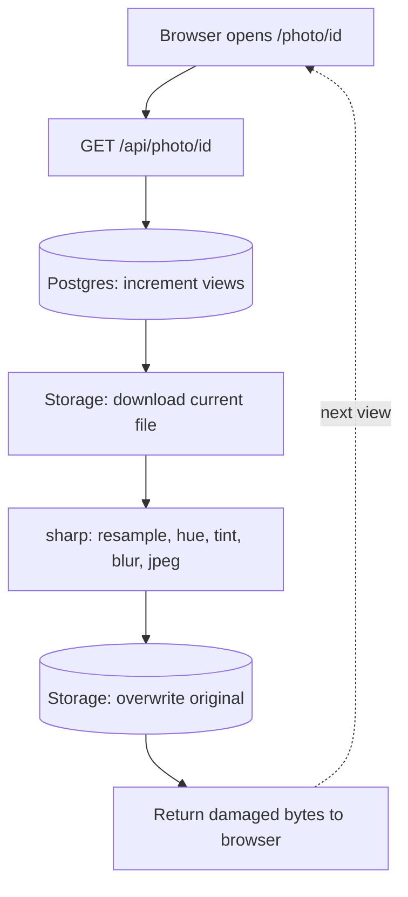

# The Decaying Album 🎯

*Every photograph here dies a little when you look.*

## Basic Details
### Team Name: eman fire


### Team Members
- Member 1: Eman Fathima
- Member 2: Salmanul Fariz

### Project Description
Upload a photograph and it begins to die. Every view degrades it — colour drifts, detail dissolves, the file shrinks. There are no originals and no backups, because looking is a destructive act and this is the only gallery honest about it. Eventually nothing remains but a number.

### The Problem (that doesn't exist)
Digital photographs are the first images in human history that don't fade. Your grandmother's photo albums yellowed, curled, and lost their colour; the ones on your phone will look exactly the same in forty years. Nobody asked for this. We have quietly accepted an immortality nobody requested, and in doing so we've made looking at a picture completely free.

Worse: we look at photographs constantly and it costs nothing. Ten thousand images scroll past and not one of them is changed by having been seen. That's not how attention works anywhere else in the universe.

### The Solution (that nobody asked for)
We made looking expensive.

The Decaying Album is a photo gallery where every single view permanently damages the image. Not a filter. Not an overlay. The actual file in storage is destroyed a little more each time, overwritten in place, with no original kept anywhere.

The mechanism is real generation loss — the same compounding degradation that happens when you photocopy a photocopy, or when a JPEG is re-saved enough times. Each view downloads the current (already damaged) file, re-processes it, and writes the worse version back over the old one. Damage compounds because every pass operates on the output of the last.

By view 30 or so, the photograph is a coloured smear. The view counter keeps going. You can still open it. There just isn't much left to see.

## Technical Details
### Technologies/Components Used
For Software:
- **Languages:** JavaScript
- **Frameworks:** Next.js 16 (App Router), React
- **Libraries:** sharp (libvips image processing), @supabase/supabase-js, Tailwind CSS
- **Tools:** Supabase (Postgres + Storage), Vercel, Git

For Hardware:
- None. The only hardware involved is whatever device you're using to destroy the photographs.

### Implementation
For Software:
# Installation
```bash
git clone [REPO URL]
cd decaying-album
npm install
```

Create `.env.local` in the project root:
```
NEXT_PUBLIC_SUPABASE_URL=your-project-url
NEXT_PUBLIC_SUPABASE_PUBLISHABLE_KEY=your-publishable-key
SUPABASE_SECRET_KEY=your-secret-key
```

Create a **public** Supabase Storage bucket named `photos`, then run this in the SQL Editor:
```sql
create table photos (
  id uuid primary key default gen_random_uuid(),
  storage_path text not null,
  views int not null default 0,
  created_at timestamptz default now()
);

create function increment_views(photo_id uuid)
returns int as $$
  update photos set views = views + 1
  where id = photo_id
  returning views;
$$ language sql;
```

# Run
```bash
npm run dev
```

---

## The Decay Pipeline (the unnecessary part, documented)

Every request to `/api/photo/[id]` runs this sequence. Note that step 6 is what
makes this irreversible — the damaged file is written back over the original
path with `upsert: true`. There is no archive.

1. **Look up the photograph** in Postgres by id.
2. **Increment the view counter** via an atomic Postgres function, so two
   simultaneous viewers can't race and corrupt the file in a boring way.
3. **Download the current file** — already damaged from every previous view.
4. **Compute damage severity** from the view count.
5. **Run the decay pipeline** (below).
6. **Overwrite the original in storage.** The previous state ceases to exist.
7. **Return the damaged bytes** to the person who caused the damage.

The pipeline order matters more than the individual effects:

| Stage | Operation | Why |
|---|---|---|
| 1 | Downscale, then upscale with nearest-neighbour | Resampling loss. Nearest-neighbour on the way back up produces hard blocky pixels instead of smooth interpolation. Must run **first** — any later resize would smooth over everything after it. |
| 2 | Hue rotation, randomised per view | Colour drifts unpredictably. Random per request means no two photographs die the same way. |
| 3 | Channel tint, scaling with view count | Red and green decay faster than blue, so the image drifts toward a cold cast as it ages. |
| 4 | Gaussian blur | Structural softening. Compounds hard. |
| 5 | JPEG re-encode at falling quality | Generation loss. The original sin of digital photography. |

**Design note on ordering:** sharp executes chained operations in sequence, and
any resampling operation smooths over structural damage applied before it. An
early version applied blur before the upscale and the blur was invisible —
the resize was interpolating it away. Resampling must come first; anything you
want to survive goes last.

**Design note on convergence:** JPEG re-encoding converges. Re-saving an
already-destroyed image at low quality barely changes it, so the damage
plateaus. The colour operations don't converge — they compound indefinitely —
which is why the late stages of a photograph's life are defined by colour drift
rather than blocking.

### Project Documentation
For Software:

# Screenshots (Add at least 3)


*The upload page. The button says "give it away", which is accurate.*


*The gallery. Each photograph is at a different stage of death depending on how much attention it has received. View counts are shown beneath each one.*


*The same photograph at views 1, 10, 20 and 30. No filter was applied. This is the same file, overwritten thirty times.*

# Diagrams

*Each view reads the already-damaged file, damages it further, and writes it back. No original is kept.*

### Project Demo
# Video
[ADD DEMO VIDEO LINK]
*A photograph being opened repeatedly until nothing recognisable remains, in real time. No editing, no speed-up — every frame in the video is a real HTTP request that really destroyed the file.*

# Additional Demos
[Decaying Album](https://decaying-album.vercel.app/)

---
Made with ❤️ at TinkerHub Useless Projects


